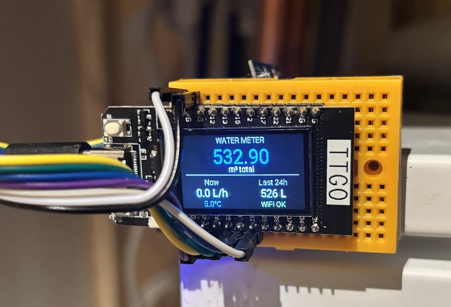
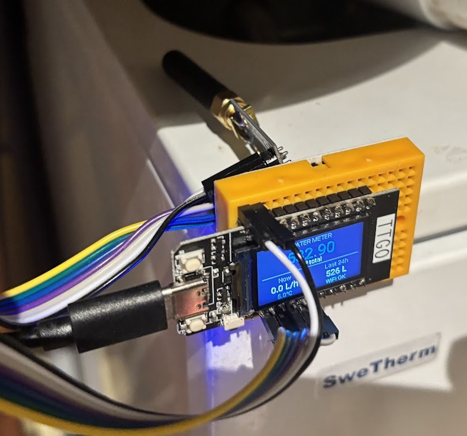

# ESPHome Kamstrup Multical 21 Water Meter Reader

[](https://github.com/petterl/esp32-multical21/actions/workflows/ci.yml)


An ESPHome external component for wirelessly reading Kamstrup Multical 21 water meters using a CC1101 radio module.



## Features

- Native ESPHome integration with Home Assistant
- Automatic device discovery
- OTA updates support
- AES-128 decryption (requires key from water utility)
- CRC validation of received data
- Wireless reading via wM-Bus Mode C1 (868.95 MHz)
- Diagnostic sensors for troubleshooting (frame count, CRC errors, signal quality)
- Input validation with clear error messages

## Quick Start

**1. Add to your ESPHome YAML:**

```yaml
external_components:
  - source: github://petterl/esp32-multical21@master
    components: [multical21]

spi:
  clk_pin: GPIO4
  mosi_pin: GPIO6
  miso_pin: GPIO5

multical21:
  cs_pin: GPIO7
  gdo0_pin: GPIO10
  meter_id: "12345678"
  key: "00112233445566778899AABBCCDDEEFF"

sensor:
  - platform: multical21
    total_consumption:
      name: "Total Water Consumption"
    current_flow:
      name: "Current Water Flow"
```

**2. Get your credentials:**

- **Meter ID**: 8 hex characters from the sticker on your water meter
- **AES Key**: 32 hex characters — contact your water utility provider

**3. Flash and go!** The component validates your config at compile time and shows clear errors if the meter ID or key format is wrong.

## Installation

Add the external component to your ESPHome YAML:

```yaml
external_components:
  - source: github://petterl/esp32-multical21@master
    components: [multical21]
```

Then configure the SPI bus and component for your board. See [Example Configurations](#example-configurations) below.

## Configuration Reference

### Component (`multical21:`)

| Key               | Type   | Required | Description                                 |
| ----------------- | ------ | -------- | ------------------------------------------- |
| `cs_pin`          | pin    | Yes      | SPI chip select pin for CC1101              |
| `gdo0_pin`        | pin    | Yes      | CC1101 GDO0 interrupt pin                   |
| `meter_id`        | string | Yes      | 8 hex characters from meter sticker         |
| `key`             | string | Yes      | 32 hex character AES key from water utility |
| `update_interval` | time   | No       | Polling interval (default: `1s`)            |

### Sensors (`sensor:` platform: multical21)

| Key                   | Unit  | Description                         | HA Category |
| --------------------- | ----- | ----------------------------------- | ----------- |
| `total_consumption`   | m3    | Total water consumption             | Primary     |
| `month_start_value`   | m3    | Consumption at billing period start | Primary     |
| `water_temperature`   | C     | Water temperature                   | Primary     |
| `ambient_temperature` | C     | Ambient temperature                 | Primary     |
| `current_flow`        | L/h   | Current flow rate                   | Primary     |
| `frames_received`     | count | Successfully received frames        | Diagnostic  |
| `crc_errors`          | count | CRC validation failures             | Diagnostic  |
| `signal_quality`      | %     | Frame success rate                  | Diagnostic  |

### Text Sensors (`text_sensor:` platform: multical21)

| Key           | Description                | HA Category |
| ------------- | -------------------------- | ----------- |
| `last_update` | Reading counter and uptime | Diagnostic  |

All sensors are optional — include only the ones you need. Icons are set automatically.

## Example Configurations

Complete example configurations for different boards are available in the [examples/](examples/) folder:

| Board               | Example File                            |
| ------------------- | --------------------------------------- |
| ESP32-C3 Super Mini | [esp32-c3.yaml](examples/esp32-c3.yaml) |
| Standard ESP32      | [esp32.yaml](examples/esp32.yaml)       |
| ESP8266 (D1 Mini)   | [esp8266.yaml](examples/esp8266.yaml)   |

**To get started:**

1. Copy the example that matches your board
2. Create a `secrets.yaml` based on [secrets.yaml.example](examples/secrets.yaml.example)
3. Flash with ESPHome

## Hardware

### Parts

- [CC1101 868MHz Module](https://s.click.aliexpress.com/e/_oDW0qJ2)
- [ESP32-C3 Super Mini](https://s.click.aliexpress.com/e/_c3HOPvoX) (or other ESP32/ESP8266)
- Connecting wires

### Wiring (ESP32-C3 Super Mini)

| CC1101 | ESP32-C3 |
| ------ | -------- |
| VCC    | 3V3      |
| GND    | GND      |
| CSN    | GPIO 7   |
| MOSI   | GPIO 6   |
| MISO   | GPIO 5   |
| SCK    | GPIO 4   |
| GDO0   | GPIO 10  |
| GD2    | NC       |


See [E01-M11010_PINOUT.md](E01-M11010_PINOUT.md) for detailed CC1101 module pinout and wiring for other boards.

## Home Assistant

The component automatically creates entities in Home Assistant:

- **Total Water Consumption** - Current total in m³ (Energy Dashboard compatible)
- **Month Start Value** - Billing period start value in m³
- **Water Temperature** - Flow temperature in °C
- **Ambient Temperature** - Room temperature in °C
- **Current Flow** - Flow rate in L/h

### Energy Dashboard

To add to the Energy Dashboard:

1. Go to **Settings** → **Dashboards** → **Energy**
2. Click **Add Water Source**
3. Select **Total Water Consumption** sensor

### Utility Meter

For daily/weekly/monthly tracking, add to your Home Assistant `configuration.yaml`:

```yaml
utility_meter:
  daily_water:
    source: sensor.water_meter_total_water_consumption
    cycle: daily
  monthly_water:
    source: sensor.water_meter_total_water_consumption
    cycle: monthly
```

## Troubleshooting

### No readings received

- Verify your meter ID matches your physical meter (8 hex chars, check the sticker)
- Check that you have the correct AES encryption key (32 hex chars, from your water utility)
- Ensure wiring is correct, especially SPI connections
- Check debug logs for CC1101 initialization errors
- Add diagnostic sensors (`frames_received`, `crc_errors`, `signal_quality`) to see what's happening

### CC1101 not responding

- Verify 3.3V power supply (**NOT 5V!**)
- Check SPI wiring (MOSI, MISO, SCK, CS)
- Try adding a 100nF capacitor between VCC and GND

### Weak signal

- Position the device closer to the water meter
- Use a proper 868 MHz antenna if your module has a connector

### Diagnostic sensors

Add these to your YAML for troubleshooting:

```yaml
sensor:
  - platform: multical21
    frames_received:
      name: "Frames Received"
    crc_errors:
      name: "CRC Errors"
    signal_quality:
      name: "Signal Quality"
```

- **frames_received = 0**: No frames from your meter are being received (check wiring and antenna)
- **crc_errors increasing**: Frames received but corrupted (check antenna placement, reduce distance)
- **signal_quality < 80%**: Poor reception (move device closer or improve antenna)

## Technical Details

| Parameter  | Value          |
| ---------- | -------------- |
| Protocol   | wM-Bus Mode C1 |
| Frequency  | 868.95 MHz     |
| Modulation | 2-GFSK         |
| Data Rate  | ~103 kbps      |
| Encryption | AES-128 CTR    |
| CRC        | EN13757        |

## Credits

Based on work by:

- [Patrik Thalin](https://github.com/pthalin/esp32-multical21) - Original ESP32 implementation
- [Chester](https://github.com/chester4444/esp-multical21) - wM-Bus protocol implementation

## License

GPL-3.0 - See [LICENSE](LICENSE)
